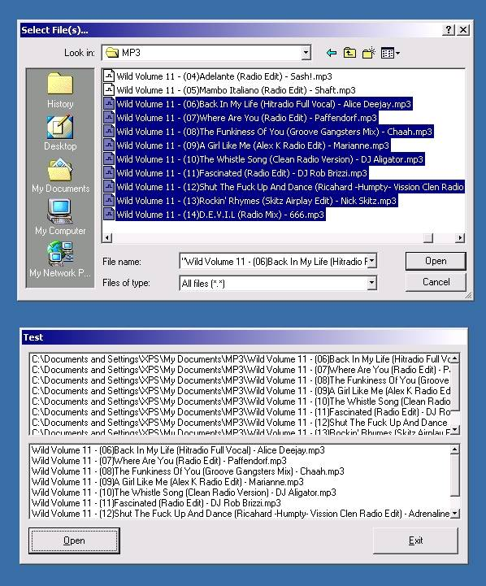



## Multi File Select CommonDialog Box \- Must have for MP3 players

### Description

Lets you select Multi files out of a CommonDialog box and list the paths in one list and the filesname in another

This code is a must have for people making a MP3 player

Please tell me what you think, and vote!
 
### More Info
 

             |
---                |---
**Submitted On**   |2000-10-17 14:14:06
**By**             |[\-=XPS=\-](https://github.com/Planet-Source-Code/PSCIndex/blob/master/ByAuthor/xps.md)
**Level**          |Beginner
**User Rating**    |4.3 (26 globes from 6 users)
**Compatibility**  |VB 5\.0, VB 6\.0
**Category**       |[Files/ File Controls/ Input/ Output](https://github.com/Planet-Source-Code/PSCIndex/blob/master/ByCategory/files-file-controls-input-output__1-3.md)
**World**          |[Visual Basic](https://github.com/Planet-Source-Code/PSCIndex/blob/master/ByWorld/visual-basic.md)
**Archive File**   |[CODE\_UPLOAD1071110172000\.zip](https://github.com/Planet-Source-Code/xps-multi-file-select-commondialog-box-must-have-for-mp3-players__1-12096/archive/master.zip)

